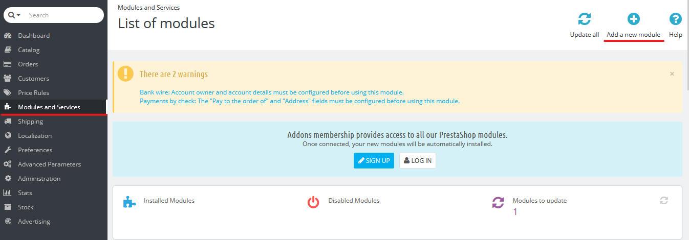
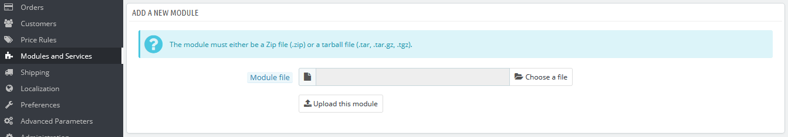
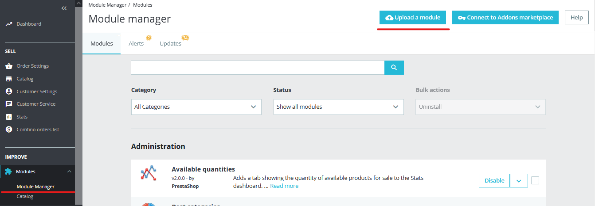
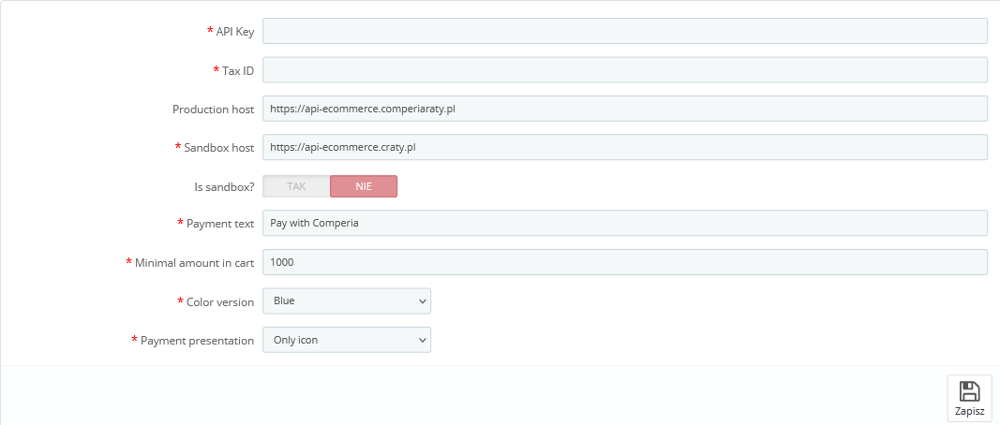

## DOWNLOAD PLUGIN

Open page https://github.com/comfino/PrestaShop/releases and download latest plugin

## INSTALATION

Prestashop 1.6.*
----------------

To install the module, please go to `"Modules -> Modules and services"` tab and then click `"Add new module"` button, then panel with `"Module file"` input should appear. In this input choose module's file and click `"Send module button"`. If the module was uploaded, then it should be visible on modules list. Then you should just choose the module and click `"Install"` button.

Prestashop 1.7.*
----------------

To install the module, please go to `"Modules -> Modules Manager"` tab, and then click `"Upload module"` button.
To the field that appears, put module's file. Module will be installed automaticly.

## CONFIGURATION

For the module correct work, configuration is required. You can do this by click `"Configure"` in module information panel. There are couple of important field that should be filled: `"Api-Key"`, Tax ID. There are unimportant fields that have their default values.

* Payment text - this is text that will be showing near by payment option. Default value is `"Pay with Comperia"`
* Repayment time - default value "12" months. Value should be number
* Minimal amount in cart - default value is 1000 zł. Value should be number

## ATTENTION

* For the module correct work, phone number field in checkout must be set required.
* HTTP's PUT Method should be enabled on the server.
* Required data in the Comfino plugin:
    * Customer:
        * first name - 2-63 characters
        * last name - 2-63 characters
        * email address - valid email address
        * valid polish mobile phone number (expected format: xxxxxxxxx, xxx xxx xxx, +48 xxxxxxxxx).
    * Card:
        * total amount
        * list of products
            * name
            * quantity
            * price
    * Address:
        * street
        * building number
        * apartment number
        * postal code
        * city
        * country code

## STATUS NOTIFICATIONS:

Change order status to complete. The result is invoice and shipment products.

* ACCEPTED
* WAITING_FOR_PAYMENT
* PAID

## FLOW

