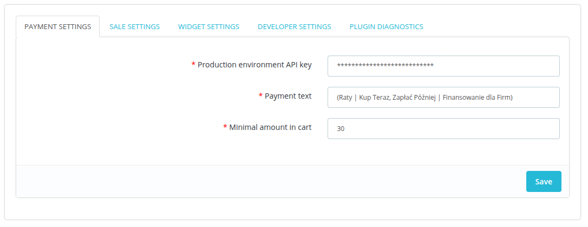
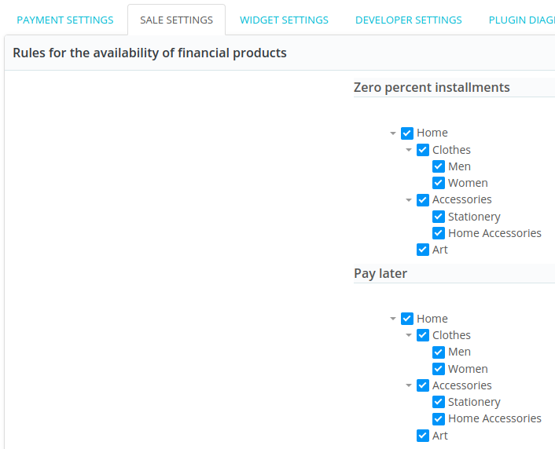
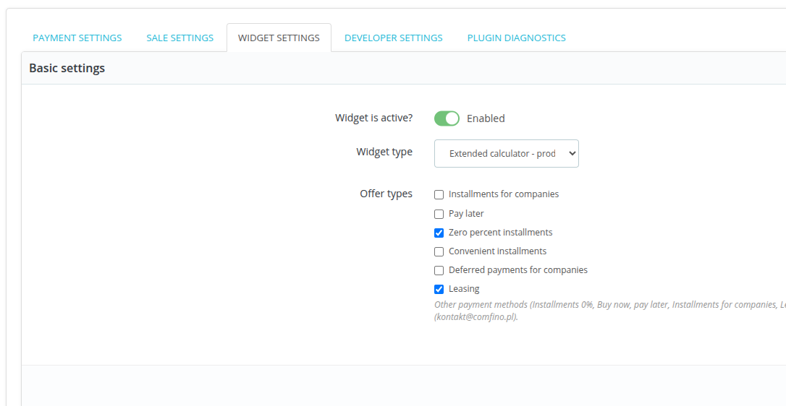
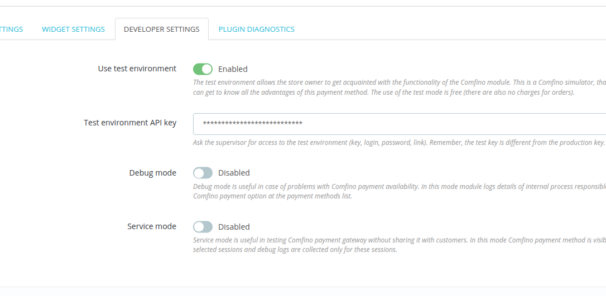

## REQUIREMENTS

- **PrestaShop**: 1.6.x, 1.7.x, 8.x, 9.x (minimal supported version of PrestaShop is 1.6.1.11)
- **PHP**: 7.1 or higher
- **PHP extensions**: curl, json, zlib

For legacy environments the latest version of the plugin compatible with PHP 5.6 and PrestaShop 1.6.0.14+: [3.5.5](https://github.com/comfino/PrestaShop/releases/tag/3.5.5)  
It can be downloaded from here: [comfino.zip](https://github.com/comfino/PrestaShop/releases/download/3.5.5/comfino.zip)  
We strongly recommend upgrading your store environment to at least version 1.7.8.11 and using plugins version 4.x.

## PLUGIN DOWNLOAD

Download the latest version of the plugin from the website: https://github.com/comfino/PrestaShop/releases

## INSTALLATION

On-line version of the documentation: https://comfino.pl/plugins/PrestaShop/en

PrestaShop 1.6
-------

To install the module, please go to `"Modules -> Modules and services"` tab and then click `"Add new module"` button, then panel with `"Module file"` input should appear.
In this input choose module's file and click `"Send module button"`. If the module was uploaded, then it should be visible on modules list. Then you should just choose the module and click `"Install"` button.

PrestaShop 1.7, PrestaShop 8
-------

To install the module, please go to `"Modules -> Modules Manager"` tab, and then click `"Upload module"` button.
To the field that appears, put module's file. Module will be installed automatically.

## CONFIGURATION

The configuration parameters of the module are grouped by categories corresponding to the tabs of the configuration panel: `"PAYMENT SETTINGS"`, `"SALE SETTINGS"`, `"WIDGET SETTINGS"`, `"DEVELOPER SETTINGS"`.
The last tab `"PLUGIN DIAGNOSTICS"` does not contain any parameters to be set and has an information-diagnostic function. Among other things, it contains a local error log.

Before using Comfino payments, the module must be configured. You can do this by clicking `"Configure"` in the module info panel.

The most important field that must be filled in is the "Production Environment API Key" field from the `"PAYMENT SETTINGS"` tab.
In the `"DEVELOPER SETTINGS"` tab, there is a second key field - `"Test environment API key"`.

Configuration parameter fields:

**PAYMENT SETTINGS**

* **Production environment API key** — a unique access key that allows the module to communicate with the Comfino API (you will receive it from a Comfino representative)
* **Payment text** — text displayed on the list of payment methods (default `"(Raty | Kup Teraz, Zapłać Póżniej | Finansowanie dla Firm)"`)
* **Minimal amount in cart** — the value of the cart from which Comfino payment is available (default: 30 PLN)
* **Use order reference as external ID** — Use customer-visible order reference instead of numeric order ID for Comfino API integration. New orders only.

**SALE SETTINGS**

The tab contains settings related to sales management.

Financial product availability rules (product category filters) enable Comfino payments to be assigned to specific product categories. Category filters are divided into sections corresponding to available methods of financing purchases under the contract concluded with Comfino. Moreover, managing the availability of Comfino payments is only possible for the following types of financial products: "Zero percent installments", "Pay later", "Leasing". If the concluded contract does not include one or all of these items, the tab will contain a list of trees limited to this one financing method or it will contain a list of trees for other types of products from the contract, if the contract does not include the "Zero percent installments", "Pay later" and "Leasing" products.

By default, Comfino payments are available unconditionally for all product types. To disable Comfino for selected product types, uncheck the appropriate categories in the category tree for each type of financial offer and click "Save".

**WIDGET SETTINGS**

**Basic Settings**

* **Widget is active?** — promotional widget activation/deactivation switch on the product page
* **Widget type** — way of presenting the widget [`Standard widget`, `Classic widget`]
* **Offer types** — types of financing offers promoted [`Zero percent installments`, `Convenient installments`, `Pay later`, `Installments for companies`, `Deferred payments for companies`, `Leasing`]
* **Show logos of financial services providers** — switch enabling to display the logo of each available financial provider

The availability of offer types on the list depends on the individual contract and may differ from that described in the documentation.

**Advanced settings**

* **Widget price element selector** — HTML document element containing the price of the product
* **Widget anchor element selector** — widget container element (widget is embedded in it)
* **Price change detection — container selector** — HTML document element containing a price element directly or indirectly used to track price changes and recalculate offers
* **Price change detection — container hierarchy level** — DOM hierarchy level used to track price changes and recalculate offers
* **Embedding method** — how the widget is oriented relative to the container element [`INSERT_INTO_FIRST`, `INSERT_INTO_LAST`, `INSERT_BEFORE`, `INSERT_AFTER`]
* **Custom banner CSS style** — Link to a CSS file with styles overriding the banner's appearance (only absolute addresses from the store's domain are accepted)
* **Custom calculator CSS style** — Link to a CSS file with styles overriding the calculator's appearance (only absolute addresses from the store's domain are accepted)
* **Widget initialization code** — JavaScript script to initialize the widget on the product page (making changes not recommended for non-advanced users without JavaScript knowledge)

Detailed information on the operation of the widget and its configuration options can be found in a separate [Comfino widget documentation](https://comfino.pl/widgets/comfino-prestashop/en).

**DEVELOPER SETTINGS**

* **Use test environment** — developer mode activation/deactivation switch
* **Test environment API key** — a unique access key enabling the module to communicate with the Comfino test API
* **Debug mode** — debug mode activation/deactivation switch
* **Service mode** — service mode activation/deactivation switch

Debug mode is useful in case of problems with Comfino payment availability. In this mode module logs details of internal process responsible for displaying of Comfino payment option at the payment methods list. It is recommended to use this option together with activating the second option `"Service mode"` to minimize the saved logs.

Debug mode is useful in case of problems with Comfino payment availability. In this mode module logs details of internal process responsible for displaying of Comfino payment option at the payment methods list.

**Note**

Before launching payments on the production store, disable developer mode to block the use of the Comfino payment test environment.

**PLUGIN DIAGNOSTICS**

The tab contains technical information about the plugin and the environment (plugin version, store version, PHP and web server version, etc.).\

It also contains a list of recent errors with a preview of the local error log and a list of the plugin's internal operations recorded in debug mode (debug mode log).
There is also an option to clear the error log as well as the list of internal operations in debug mode.

The **Module Reset** section allows you to restore the module to its initial configuration without losing any data or individual business settings.\
The reset operation performs the following actions:
* Adds missing configuration options – supplements the configuration with missing settings while retaining existing values.
* Registers all PrestaShop hooks – ensures the module is properly connected to the store's system mechanisms.
* Restores custom order statuses – restores statuses used by the module if they have been deleted or corrupted.
* Clears the module cache – clears the cache, eliminating issues resulting from outdated data.

**Note**: Resetting the module does not delete existing configuration or data (e.g., settings, mappings, transaction history).

To perform a reset, click the "Reset Module" button.

This tab also contains a record of operations performed during module installation, update and uninstallation.

**When to view logs:**

Installation log:
* **After initial module installation – verifying correct configuration**
* **When problems occur with order statuses or hooks**

Update log:
* **After updating the module to a newer version**
* **When unexpected errors occur after updating**

Uninstallation log:
* **After uninstallation – verifying that the process completed correctly**

Information about developer mode activity is displayed in the tabs `"PAYMENT SETTINGS"` and `"PLUGIN DIAGNOSTICS"`.
In this mode, the plugin uses the key from the `"DEVELOPER SETTINGS"` tab to communicate with the Comfino test API. You will also receive a test environment key from a Comfino representative.

## REMARKS

* The Comfino payment module requires you to set the customer's phone number as required in the process of entering the customer's contact details. The phone number is used to send codes and inform the customer about the status of the transaction, at a later stage of Comfino payment processing. In case of absence of a telephone number, the Comfino payment transaction will end with an error displayed on the store's website.
* The module notification system requires the availability of the HTTP "PUT" method. The module receives information about changes in the status of Comfino transactions and changes the internal order status in PrestaShop accordingly. In case of problems with notifications, check the web server settings in your hosting panel.
* Customer and order data required by the Comfino module:
    * Customer:
        * first name - 2-63 characters
        * last name - 2-63 characters
        * email address - valid e-mail address
        * valid Polish mobile phone number (expected format: xxxxxxxxx, xxx xxx xxx, +48 xxxxxxxxx).
    * Cart:
        * total amount
        * list of products
            * name
            * quantity
            * price
    * Address:
        * street
        * building number
        * apartment number
        * postal code
        * city
        * country code

## SAMPLE CART VIEW WITH A LIST OF PAYMENT METHODS

## COMFINO PROCESS FLOW

