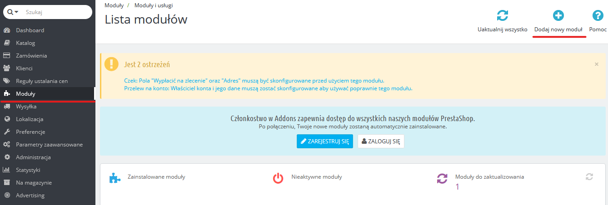
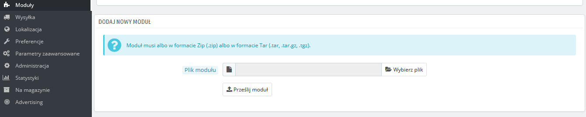
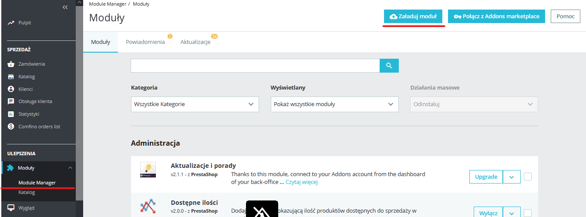
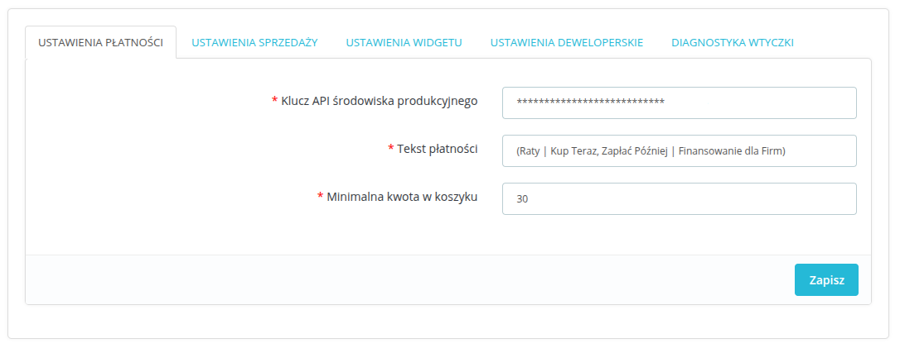
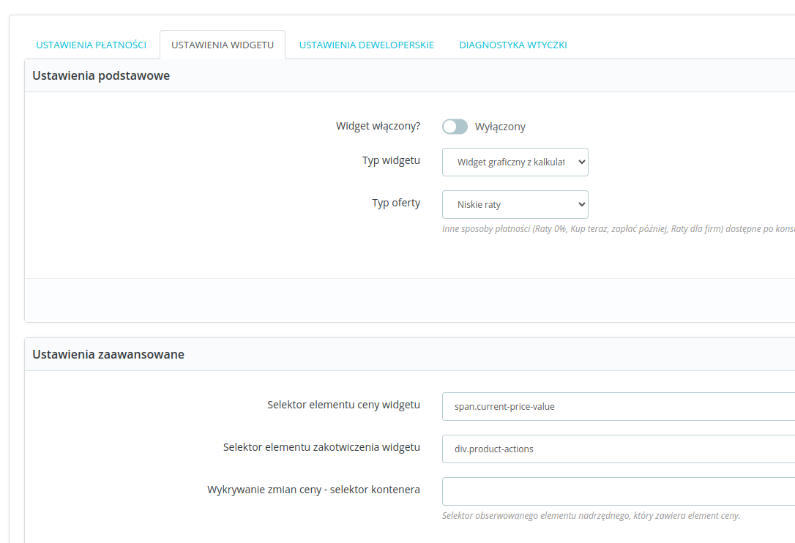
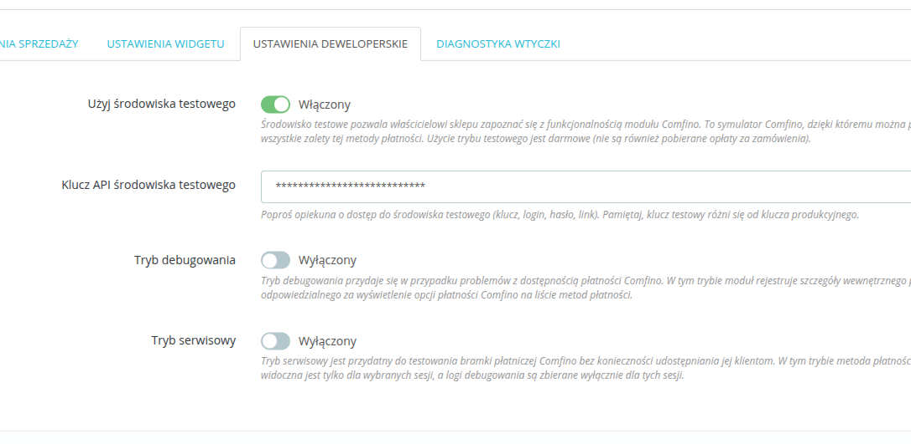
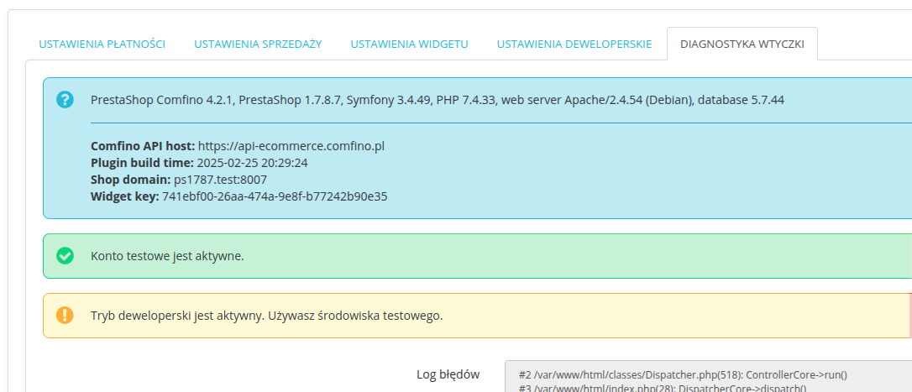

## POBIERANIE WTYCZKI

Pobierz najnowszą wersję wtyczki ze strony: https://github.com/comfino/PrestaShop/releases

## INSTALACJA

PrestaShop 1.6
-------

Przejdź do zakładki `"Moduły -> Moduły i usługi"`, następnie kliknij przycisk `"Dodaj nowy moduł"`. Wysunie się panel z polem `"Plik modułu"`. W tym polu należy wybrać plik z modułem, a następnie kliknąć `"Prześlij moduł"`. Kiedy moduł zostanie przesłany, wystarczy wybrać go z listy modułów, a następnie kliknąć `"Instaluj"`.

PrestaShop 1.7, PrestaShop 8
-------
Przejdź do zakładki `"Moduły -> Manager modułów"`, następnie kliknij przycisk `"Załaduj moduł"`. Z wyświetlonego pola do przesyłania modułów, należy wybrać odpowiedni plik z modułem. Wtyczka zainstaluje się automatycznie.

## KONFIGURACJA

Parametry konfiguracyjne modułu są pogrupowane kategoriami odpowiadającymi zakładkom panelu konfiguracyjnego: `"USTAWIENIA PŁATNOŚCI"`, `"USTAWIENIA WIDGETU"`, `"USTAWIENIA DEWELOPERSKIE"`.
Ostatnia zakładka `"DIAGNOSTYKA WTYCZKI"` nie zawiera żadnych parametrów do ustawienia i pełni funkcję informacyjno-diagnostyczną. Zawiera między innymi lokalny dziennik błędów (log błędów).

Przed użyciem płatności Comfino, moduł musi zostać skonfigurowany. Możesz to zrobić, klikając `"Konfiguruj"` w panelu informacyjnym modułu.

Najważniejsze pole, które musi być uzupełnione, to pole `"Klucz API środowiska produkcyjnego"` z zakładki `"USTAWIENIA PŁATNOŚCI"`.
W zakładce `"USTAWIENIA DEWELOPERSKIE"` znajduje się pole drugiego klucza - `"Klucz API środowiska testowego"`.

Pola parametrów konfiguracyjnych:

**USTAWIENIA PŁATNOŚCI**

* Klucz API środowiska produkcyjnego — unikalny klucz dostępowy umożliwiający komunikację modułu z API Comfino (otrzymasz go od przedstawiciela Comfino)
* Prezentacja płatności — sposób prezentacji Comfino na liście metod płatności [`Tylko ikona`, `Tylko tekst`, `Ikona i tekst`]
* Tekst płatności — tekst wyświetlany na liście metod płatności (domyślnie `"(Raty | Kup Teraz, Zapłać Póżniej | Finansowanie dla Firm)"`)
* Minimalna kwota w koszyku — wartość koszyka, od której dostępna jest płatność Comfino (domyślnie: 30 zł)

**USTAWIENIA WIDGETU**

**Ustawienia podstawowe**

**Ustawienia zaawansowane**

**USTAWIENIA DEWELOPERSKIE**

**DIAGNOSTYKA WTYCZKI**

Informacja o aktywności trybu deweloperskiego jest wyświetlana w zakładkach `"USTAWIENIA PŁATNOŚCI"` i `"DIAGNOSTYKA WTYCZKI"`.
W trybie tym wtyczka używa klucza z zakładki `"USTAWIENIA DEWELOPERSKIE"` do komunikacji z testowym API Comfino. Klucz środowiska testowego również otrzymasz od przedstawiciela Comfino.

## UWAGI

* Moduł płatności Comfino wymaga ustawienia numeru telefonu klienta jako wymaganego w procesie wprowadzania danych kontaktowych klienta. Numer telefonu jest używany do przesyłania kodów i informowania klienta o statusie transakcji, na dalszym etapie procesowania płatności Comfino. 
* System notyfikacji modułu wymaga dostępności metody HTTP "PUT". Moduł otrzymuje informacje o zmianach statusu transakcji Comfino i stosownie zmienia wewnętrzny status zamówienia w PrestaShop. W przypadku problemów z notyfikacjami należy sprawdzić ustawienia serwera www w Twoim panelu hostingu.
* Dane klienta i zamówienia wymagane przez moduł Comfino:
    * Klient:
        * imię — 2-63 znaków
        * nazwisko — 2-63 znaków
        * e-mail — poprawny adres e-mail
        * telefon — poprawny polski numer komórkowy (oczekiwany format: xxxxxxxxx, xxx xxx xxx, +48 xxxxxxxxx).
    * Koszyk:
        * kwota koszyka
        * lista produktów
            * nazwa
            * ilość
            * cena
    * Adres:
        * ulica
        * numer budynku
        * numer mieszkania
        * kod pocztowy
        * miasto
        * kod kraju

## PRZEBIEG PROCESU COMFINO

