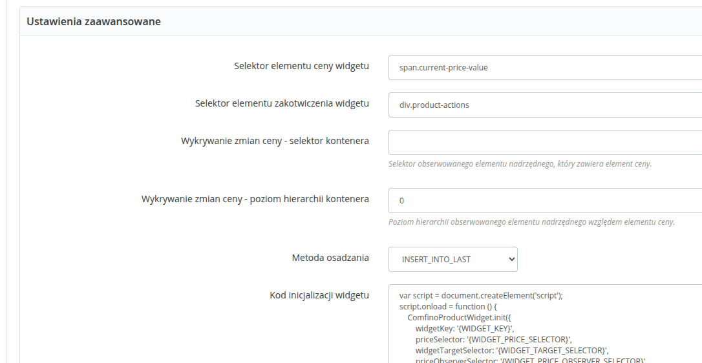

## POBIERANIE WTYCZKI

Pobierz najnowszą wersję wtyczki ze strony: https://github.com/comfino/PrestaShop/releases

## INSTALACJA

Wersja on-line dokumentacji: https://comfino.pl/plugins/PrestaShop/pl

PrestaShop 1.6
-------

Przejdź do zakładki `"Moduły -> Moduły i usługi"`, następnie kliknij przycisk `"Dodaj nowy moduł"`. Wysunie się panel z polem `"Plik modułu"`.
W tym polu należy wybrać plik z modułem, a następnie kliknąć `"Prześlij moduł"`. Kiedy moduł zostanie przesłany, wystarczy wybrać go z listy modułów, a następnie kliknąć `"Instaluj"`.

PrestaShop 1.7, PrestaShop 8
-------

Przejdź do zakładki `"Moduły -> Manager modułów"`, następnie kliknij przycisk `"Załaduj moduł"`. Z wyświetlonego pola do przesyłania modułów, należy wybrać odpowiedni plik z modułem. Wtyczka zainstaluje się automatycznie.

## KONFIGURACJA

Parametry konfiguracyjne modułu są pogrupowane kategoriami odpowiadającymi zakładkom panelu konfiguracyjnego: `"USTAWIENIA PŁATNOŚCI"`, `"USTAWIENIA SPRZEDAŻY"`, `"USTAWIENIA WIDGETU"`, `"USTAWIENIA DEWELOPERSKIE"`.
Ostatnia zakładka `"DIAGNOSTYKA WTYCZKI"` nie zawiera żadnych parametrów do ustawienia i pełni funkcję informacyjno-diagnostyczną. Zawiera między innymi lokalny dziennik błędów (log błędów).

Przed użyciem płatności Comfino, moduł musi zostać skonfigurowany. Możesz to zrobić, klikając `"Konfiguruj"` w panelu informacyjnym modułu.

Najważniejsze pole, które musi być uzupełnione, to pole `"Klucz API środowiska produkcyjnego"` z zakładki `"USTAWIENIA PŁATNOŚCI"`.
W zakładce `"USTAWIENIA DEWELOPERSKIE"` znajduje się pole drugiego klucza - `"Klucz API środowiska testowego"`.

Pola parametrów konfiguracyjnych:

**USTAWIENIA PŁATNOŚCI**

* **Klucz API środowiska produkcyjnego** — unikalny klucz dostępowy umożliwiający komunikację modułu z API Comfino (otrzymasz go od przedstawiciela Comfino)
* **Tekst płatności** — tekst wyświetlany na liście metod płatności (domyślnie `"(Raty | Kup Teraz, Zapłać Później | Finansowanie dla Firm)"`)
* **Minimalna kwota w koszyku** — wartość koszyka, od której dostępna jest płatność Comfino (domyślnie: 30 zł)

**USTAWIENIA SPRZEDAŻY**

Zakładka zawiera ustawienia dotyczące zarządzania sprzedażą.

Reguły dostępności produktów finansowych (filtry kategorii produktowych) umożliwiają przypisanie płatności Comfino do określonych kategorii produktów. Filtry kategorii są podzielone na sekcje odpowiadające dostępnym metodom finansowania zakupów w ramach umowy zawartej z Comfino. Ponadto zarządzanie dostępnością płatności Comfino jest możliwe tylko dla następujących typów produktów finansowych: "Raty zero procent", "Zapłać później", "Leasing". Jeśli zawarta umowa nie zawiera jednej z tych pozycji lub wszystkich, to zakładka będzie zawierała listę drzew ograniczonych do tej jednej metody finansowania lub będzie zawierać listę drzew dla pozostałych typów produktów z umowy, w przypadku braku obecności w umowie produktów "Raty zero procent", "Zapłać później" i "Leasing". 

Domyślnie płatności Comfino są dostępne bezwarunkowo dla wszystkich typów produktów. W celu wyłączenia Comfino dla wybranych typów produktów należy odznaczyć odpowiednie kategorie w drzewie kategorii dla każdego typu oferty finansowej i kliknąć "Zapisz".

**USTAWIENIA WIDGETU**

**Ustawienia podstawowe**

* **Widget włączony?** — przełącznik aktywacji/deaktywacji widgetu promocyjnego na stronie produktu
* **Typ widgetu** — sposób prezentacji widgetu [`Kalkulator rat`, `Rozszerzony kalkulator - produkty`]
* **Typy ofert** — typy promowanych ofert finansowania [`Raty zero procent`, `Niskie raty`, `Zapłać później`, `Raty dla firm`, `Odroczone płatności dla firm`, `Leasing`]

Dostępność typów ofert na liście jest uzależniona od indywidualnej umowy i może różnić się od tej opisanej w dokumentacji.

**Ustawienia zaawansowane**

* **Selektor elementu ceny widgetu** — element dokumentu HTML zawierający cenę produktu
* **Selektor elementu zakotwiczenia widgetu** — element kontenera widgetu (w nim jest osadzany widget)
* **Wykrywanie zmian ceny - selektor kontenera** — element dokumentu HTML zawierający w sobie element ceny bezpośrednio lub pośrednio używany do śledzenia zmian cen i przeliczania ofert
* **Wykrywanie zmian ceny - poziom hierarchii kontenera** — poziom hierarchii DOM używany do śledzenia zmian cen i przeliczania ofert
* **Metoda osadzania** — sposób orientacji widgetu względem elementu kontenera [`INSERT_INTO_FIRST`, `INSERT_INTO_LAST`, `INSERT_BEFORE`, `INSERT_AFTER`]
* **Niestandardowy styl CSS banera** — Odnośnik do pliku CSS ze stylami nadpisującymi wygląd banera (akceptowane są tylko adresy bezwzględne z domeny sklepu)
* **Niestandardowy styl CSS kalkulatora** — Odnośnik do pliku CSS ze stylami nadpisującymi wygląd kalkulatora (akceptowane są tylko adresy bezwzględne z domeny sklepu)
* **Kod inicjalizacji widgetu** — skrypt JavaScript inicjalizujący widget na stronie produktu (wprowadzanie zmian niezalecane dla niezaawansowanych użytkowników bez znajomości JavaScript)

Szczegółowe informacje o działaniu widgetu i jego opcjach konfiguracyjnych znajdziesz w osobnej [dokumentacji widgetu Comfino](https://comfino.pl/widgets/comfino-prestashop/pl).

**USTAWIENIA DEWELOPERSKIE**

* **Użyj środowiska testowego** — przełącznik aktywacji/deaktywacji trybu deweloperskiego
* **Klucz API środowiska testowego** — unikalny klucz dostępowy umożliwiający komunikację modułu z testowym API Comfino
* **Tryb debugowania** — przełącznik aktywacji/deaktywacji trybu debugowania
* **Tryb serwisowy** — przełącznik aktywacji/deaktywacji trybu serwisowego

Tryb debugowania przydaje się w przypadku problemów z dostępnością płatności Comfino. W tym trybie moduł rejestruje szczegóły wewnętrznego procesu odpowiedzialnego za wyświetlenie opcji płatności Comfino na liście metod płatności. Zaleca się korzystać z tej opcji wraz z aktywacją drugiej opcji `"Tryb serwisowy"` w celu minimalizacji zapisywanych logów.

Tryb serwisowy jest przydatny do testowania bramki płatniczej Comfino bez konieczności udostępniania jej klientom. W tym trybie metoda płatności Comfino widoczna jest tylko dla wybranych sesji, a logi debugowania są zbierane wyłącznie dla tych sesji.

**Uwaga**

Przed uruchomieniem płatności na sklepie produkcyjnym, wyłącz tryb deweloperski, aby zablokować użycie środowiska testowego płatności Comfino.

**DIAGNOSTYKA WTYCZKI**

Zakładka zawiera informacje techniczne o wtyczce i środowisku (wersja wtyczki, wersja sklepu, wersja PHP i serwera www, itp.).\
Zawiera też listę ostatnich błędów wraz z podglądem lokalnego dziennika błędów (log błędów) oraz listę z zapisanymi w trybie debug operacjami wewnętrznymi wtyczki (log trybu debugowania).

Informacja o aktywności trybu deweloperskiego jest wyświetlana w zakładkach `"USTAWIENIA PŁATNOŚCI"` i `"DIAGNOSTYKA WTYCZKI"`.
W trybie tym wtyczka używa klucza z zakładki `"USTAWIENIA DEWELOPERSKIE"` do komunikacji z testowym API Comfino. Klucz środowiska testowego również otrzymasz od przedstawiciela Comfino.

## UWAGI

* Moduł płatności Comfino wymaga ustawienia numeru telefonu klienta jako wymaganego w procesie wprowadzania danych kontaktowych klienta. Numer telefonu jest używany do przesyłania kodów i informowania klienta o statusie transakcji, na dalszym etapie procesowania płatności Comfino. W przypadku braku numeru telefonu transakcja płatnicza Comfino zakończy się błędem wyświetlonym na stronie sklepu. 
* System notyfikacji modułu wymaga dostępności metody HTTP "PUT". Moduł otrzymuje informacje o zmianach statusu transakcji Comfino i stosownie zmienia wewnętrzny status zamówienia w PrestaShop. W przypadku problemów z notyfikacjami należy sprawdzić ustawienia serwera www w Twoim panelu hostingu.
* Dane klienta i zamówienia wymagane przez moduł Comfino:
    * Klient:
        * imię — 2-63 znaków
        * nazwisko — 2-63 znaków
        * e-mail — poprawny adres e-mail
        * telefon — poprawny polski numer komórkowy (oczekiwany format: xxxxxxxxx, xxx xxx xxx, +48 xxxxxxxxx).
    * Koszyk:
        * kwota koszyka
        * lista produktów
            * nazwa
            * ilość
            * cena
    * Adres:
        * ulica
        * numer budynku
        * numer mieszkania
        * kod pocztowy
        * miasto
        * kod kraju

## PRZYKŁADOWY WYGLĄD KOSZYKA Z LISTĄ METOD PŁATNOŚCI

## PRZEBIEG PROCESU COMFINO

