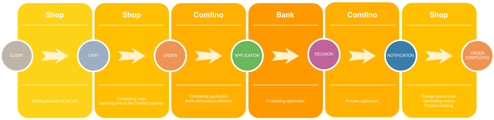

## POBIERANIE WTYCZKI

Otwórz stronę https://github.com/comfino/PrestaShop/releases i pobierz najnowszą wersje wtyczki

## INSTALACJA

Prestashop 1.6.*
-------

Aby zainstalować moduł należy przejść do zakładki `"Moduły -> Moduły i usługi"` a następnie nacisnąć przycisk `"Dodaj nowy moduł"`, wysunie się panel z polem `"Plik modułu"`, w tym polu należy wybrać plik z modułem a następnie kliknąć `"Prześlij moduł"`. Kiedy moduł zostanie przesłany wystarczy wybrać go z listy modułów a następnie kliknąć `"Instaluj"`.

Prestashop 1.7.*
-------
Aby zainstalować moduł należy przejść do zakładki `"Moduły -> Manedżer modułów"` a następnie nacisnąć przycisk `"Załaduj moduł"`. Do pola które się pojawi należy wybrać odpowiedni plik z modułem. Wtyczka zainstaluje się automatycznie.

## KONFIGURACJA

Aby moduł mógł działać konieczne jest skonfigurowanie go. Pole które są najbardziej istotne i należy je wypełnić to: `"API Key"`. 
Kolejnymi polami wartymi uwagi są:

* Nazwa płatności - pole odpowiada za tekst wyświetlany przy płatności. Domyślnie `"Pay with comperia"`
* Czas spłaty - Domyślnie 12 miesięcy
* Minimalna kwota w koszyku - Domyślnie 1000 zł

## UWAGI

* Aby moduł mógł działać poprawnie należy ustawić numer telefonu dla użytkownika w koszyku jako wymagany. 
* Metoda http "PUT" musi być aktywna
* Wymagane dane w pluginie Confino:
    * Klient:
        * imię - 2-63 znaków
        * nazwisko - 2-63 znaków
        * email - poprawny adres email
        * poprawny polski numer komórkowy (oczekiwany format: xxxxxxxxx, xxx xxx xxx, +48 xxxxxxxxx).
    * Koszyk:
        * kwota koszyka
        * lista produktów
            * nazwa
            * ilosc
            * cena
    * Adres:
        * ulica
        * numer budynku
        * numer mieszkania
        * kod pocztowy
        * miasto
        * kod kraju

## STATUSY NOTYFIKACJI:

Zmieniają status zamówenia na kompletny. Wynikiem jest faktura i wysyłka towaru.

* ACCEPTED
* WAITING_FOR_PAYMENT
* PAID

## FLOW

